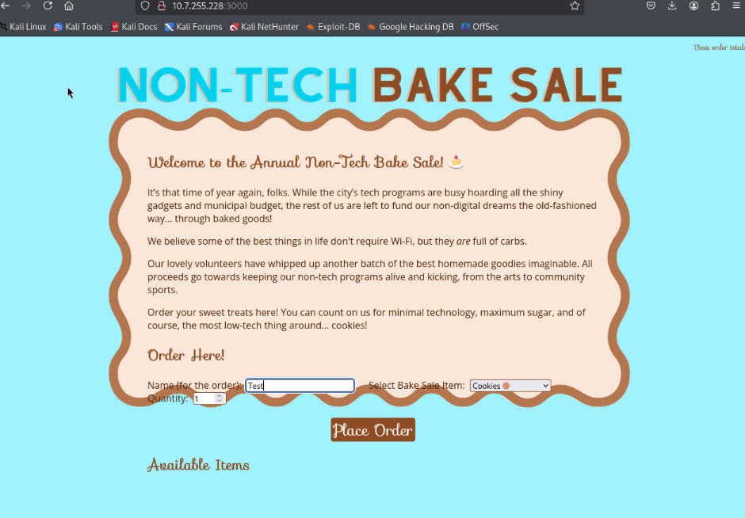
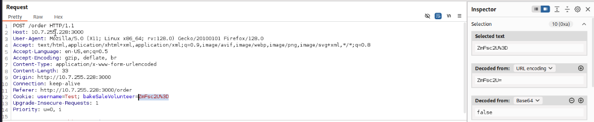

# Bake-sale

Author: Excell 
Novice 
50 Points

## Description
>We heard there’s a new autonomous street-sweeping vehicle system. The mayor’s office has since
removed some of the fleet analytics from the city website, but perhaps you can uncover hidden data in
publicly available files to learn more. Challenge Port: 3000 Flag Format: FLAG{b4ke_sale_1s_gr34t!}

### 1. Checking out the website

We connect to 10.7.255.288:3000 (as per details provided)

### 2. Let's open Burpsuite and see if anything interesting happens when we submit the form

### 3. Let's change this to 'true' and see what happens

