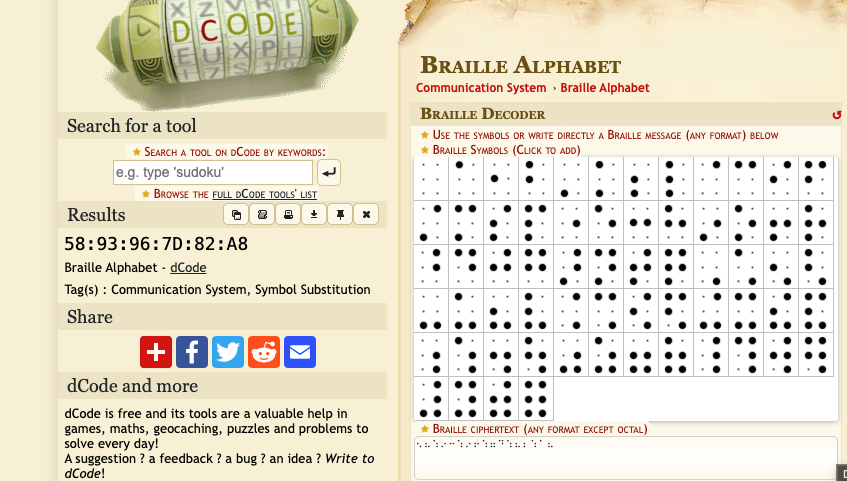
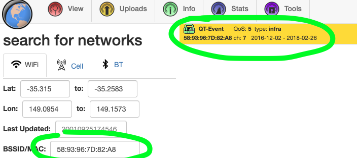

# Blink Twice

Author: Excell 
Advanced Beginner 
80 Points

## Description
> *We have identified a group of hackers attempting to breach the smart meter network of Intellitown district's
power grid. During our investigation, we intercepted a transmission that could reveal the SSID (WiFi
network) they are using for communication. ⠢:A ⠦:B ⠱:C ⠔:D ⠒:D ⠱:E ⠔:F ⠖:H ⠱:Q ⠶:7 ⠙:G ⠱:# ⠦:G ⠆:G ⠱:7 ⠁:# ⠦:2
Flag Format: FLAG{SSID}*

### 1. Looks like Brail (Thanks Tiffan)

Let's extract all the 'brail' from the given transmission and plug it into a brail decrypter:

### 2. Let's search this BSSID in wigle (as per clue given during event)

### 3. **Therefore flag = FLAG{QT-Event}**
