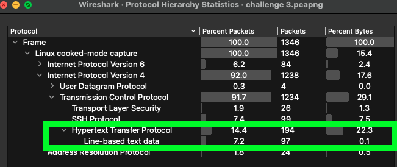
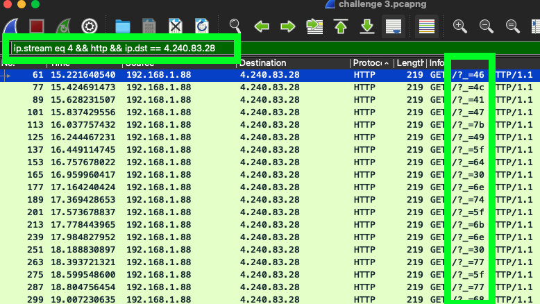
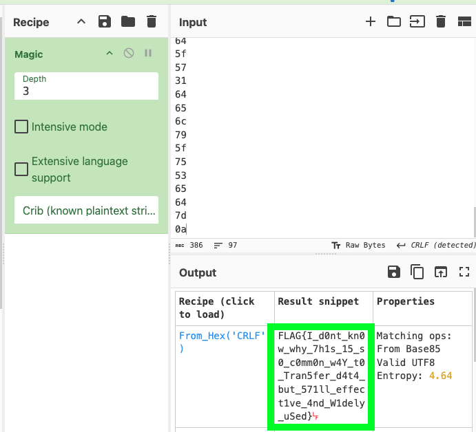

# Exfiltrate

Author: Excell 
Novice 
50 Points

## Description
>You as a forensic investigators responding to a data exfiltration attack on public safety infrastructure. By
analyzing network logs, device activity, and traffic patterns, they must uncover the breach, identify
compromised systems, and halt the exfiltration before more data is lost. Flag Format: flag{7h1s_1s_4_fl4g}

### 1. We are provided with a pcapng file, let's take a look at it in WireShark

The protocol Hierachy stats show us text data has been sent, let's take a closer look

### 2. Let's apply a filter to show all the packets where text data has been sent

### 3. Let's extract all the data and see if there's anything interesting (I used microsoft excel)

