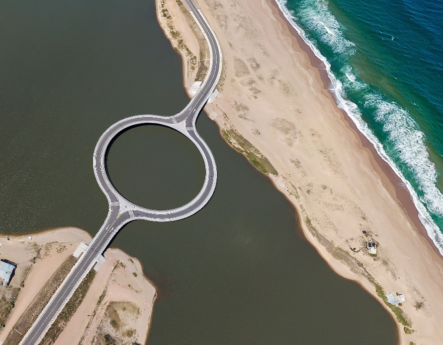
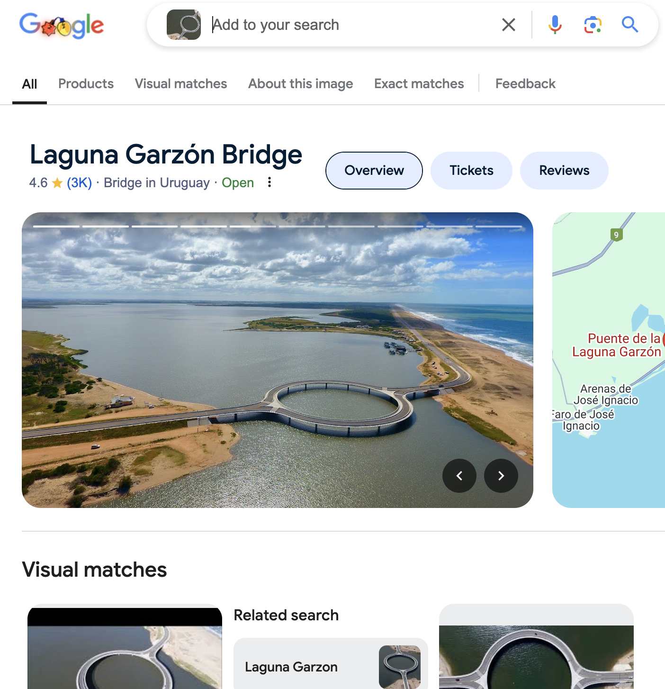

# Round Bridge

Author: Excell 
Novice 
50 Points

## Description
>I remember visiting this stunning coastal location with an unusual circular bridge, but I can’t seem to recall
its name. Can you help me figure out where this place ! PS : Put the name of this place in the flag format
FLAG{*}, all in lowercase, and replace spaces with _. FLAG: FLAG{big_round_bridge}

### 1. We are provided with the following image:

### 2. Let's reverse image search this

### 3. **Therefore flag = FLAG{Laguna_Garzon_Bridge}**
